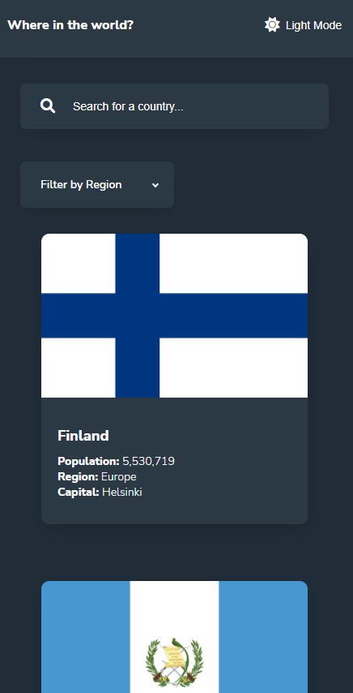
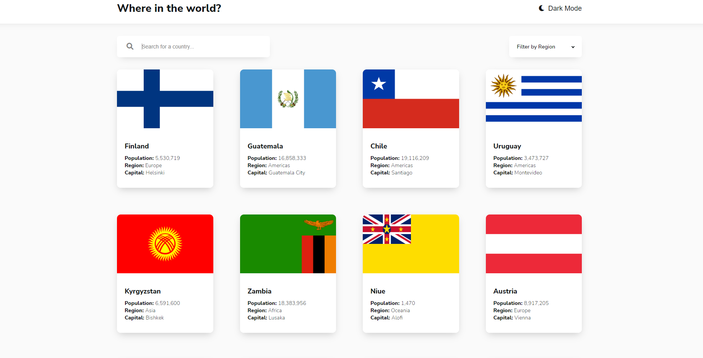

# Frontend Mentor - REST Countries API with color theme switcher

## Table of contents

- [Screenshot](#screenshot) 
- [The challenge](#the-challenge)
- [Links](#links)
- [Author](#author)
### Screenshot

<table>
        <tr>
            <td>
                
            </td>
            <td>
                
            </td>
        </tr>
</table>

## The challenge

Your challenge is to integrate with the [REST Countries API](https://restcountries.com) to pull country data and display it like in the designs.

You can use any JavaScript framework/library on the front-end such as [React](https://reactjs.org) or [Vue](https://vuejs.org). You also have complete control over which packages you use to do things like make HTTP requests or style your project.

Your users should be able to:

- See all countries from the API on the homepage
- Search for a country using an `input` field
- Filter countries by region
- Click on a country to see more detailed information on a separate page
- Click through to the border countries on the detail page
- Toggle the color scheme between light and dark mode _(optional)_

### Links

- Solution URL: [https://www.frontendmentor.io/solutions/responsive-countries-list-with-js-tYoDdC7nN7](https://www.frontendmentor.io/solutions/responsive-countries-list-with-js-tYoDdC7nN7)
- Live Site URL: [https://countries-api-livid.vercel.app/](https://countries-api-livid.vercel.app/)

## Author

- Website - [@Squashim](https://github.com/Squashim)
- Frontend Mentor - [@Squashim](https://www.frontendmentor.io/profile/Squashim)

**Have fun building!** 🚀
